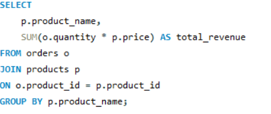
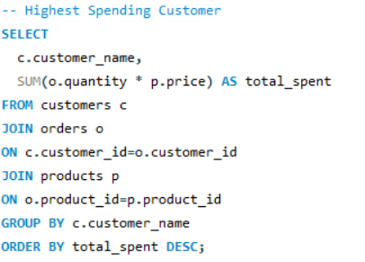
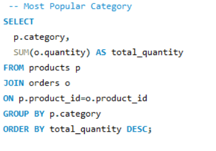
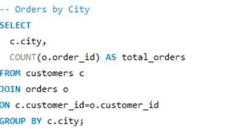

# SQL-Ecommerce-Analysis
SQL-based analysis of an e-commerce database to generate business insights using advanced SQL queries.

# SQL E-Commerce Analysis

## Project Overview

This project demonstrates SQL-based analysis of an e-commerce dataset to extract meaningful business insights. Various SQL queries were used to analyze customer behavior, product sales, revenue trends, and order performance.

## Objectives

* Analyze customer purchasing behavior
* Identify top-selling products
* Calculate revenue and sales trends
* Generate business insights using SQL

## Tools Used

* SQL
* MySQL

## SQL Concepts Used

* SELECT
* WHERE
* ORDER BY
* GROUP BY
* HAVING
* INNER JOIN
* LEFT JOIN
* Aggregate Functions
* Subqueries

## Key Insights

* Identified top-performing products based on sales.
* Analyzed customer purchasing patterns.
* Generated revenue reports using SQL queries.
* Performed data aggregation for business analysis.

## Repository Contents

* SQL query file
* Dataset
* Query output screenshots
* Project documentation

## Query Output Preview

### Revenue Analysis

### Customer Analysis

### Popular Catogary

### City

